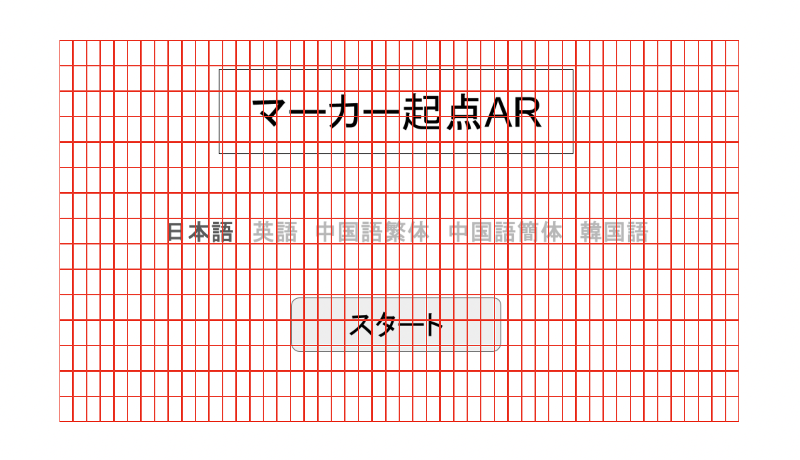
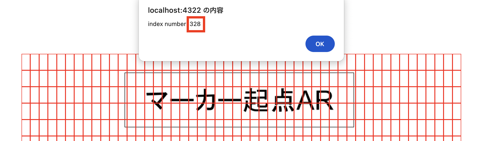

# image-click-area-setting-tool

`image-click-area-setting-tool` is a JavaScript utility for creating interactive click areas within a container element, such as an image map or grid, and handling events triggered by clicking on those areas. This tool allows you to define the number of rows and columns, specify event data, and provide a callback function to handle clicks.

## Features

- Easily create click areas within a specified container.
- Support for custom event handling when areas are clicked.
- Debug mode to visually display the clickable areas with borders.

## Installation

Install the package using npm:

```bash
npm install image-click-area-setting-tool
```
## Usage
### Importing the Tool
```javascript
import { createClickAreas } from  'image-click-area-setting-tool';
```
### Defining Event Data and Callback
Define the click event data and create a callback function to handle click events:

```javascript
const handleClick = (event) => {
  switch (event) {
    case 'start':
      alert('start event clicked');
      break;
    default:
      console.log('event not found:', event);
  }
};

export const clickEventData = [
  { index: 519, event: 'start' },
  { index: 520, event: 'start' },
  { index: 521, event: 'start' },
  // ... add more events as needed
];
```
### Creating Click Areas
Create the click areas dynamically using createClickAreas:

```javascript
const rows = 15;
const cols = 50;

const imageContainer = document.getElementById('imageContainer');

createClickAreas(rows, cols, imageContainer, clickEventData, handleClick, false);
```

## CSS
Include the following CSS to style the click areas:
```css
.click-area {
  position: absolute;
  box-sizing: border-box;
}

.click-area-debug {
  border: 1px solid red;
}

.click-area-style {
  cursor: pointer;
}
```


### API
`createClickAreas(rows, cols, container, eventItems, callback, debug)`

- `rows` (number): The number of rows for the click areas grid.
- `cols` (number): The number of columns for the click areas grid.
- `container` (HTMLElement): The container element in which to create the click areas.
- `eventItems` (ClickEventType): An array of event data objects containing the index and event.
- `callback` (function): The function to handle click events.
- `debug` (boolean, optional): Enable debug mode to visually display the clickable areas with borders.

### Example
Below is a full example of how to use the tool:

```javascript
import { createClickAreas } from 'image-click-area-setting-tool';

const handleClick = (event) => {
  switch (event) {
    case 'start':
      alert('start event clicked');
      break;
    default:
      console.log('event not found:', event);
  }
};

const clickEventData: ClickEventType = [
  { index: 519, event: 'start' },
  { index: 520, event: 'start' },
  // ... add more events as needed
];

const rows = 15;
const cols = 50;

const imageContainer = document.getElementById('imageContainer');

createClickAreas(rows, cols, imageContainer, clickEventData, handleClick, false);
```

```HTML
<div id="windowContainer" class="d-flex justify-content-center align-items-center">
    <div id="imageContainer" class="d-flex justify-content-center flex-column image-container">

    
    </div>
</div>
```

### Setting Click Area
Setting the debug option to true will launch the debug mode.
In debug mode, the click area is visualized.


You can check the index value by clicking on each element.


Once you have decided where you want the click event to occur, record it in ClickEventType array.
Record the click area that causes the event and associate the name of the event that occurs.
```javascript
const clickEventData: ClickEventType = [
  { 
    index: 328, // Setting index number on click area.
    event: 'start' // Setting causes the event name.
  },
  // ... add more events as needed
];
```

Once you have set the event occurrence location, set the event associated with the specified event name.
```javascript
const handleClick = (event) => {
  switch (event) {
    case 'start':
      alert('start event clicked');
      break;
    default:
      console.log('event not found:', event);
  }
};
```

### License
This project is licensed under the MIT License - see the LICENSE file for details.

### Contributing
Feel free to contribute to this project by submitting a pull request or opening an issue.